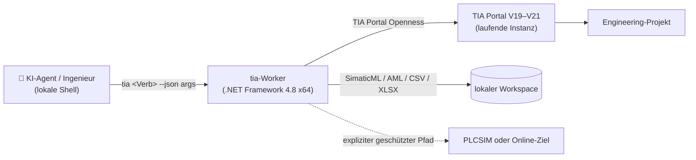

<!-- ====================== BEGIN NAV INDEX ====================== -->
<!-- NAV INDEX — auto-generated symbol map (refresh via the navindex skill) -->
<!--   L19     3.2K  ⚡ tia-cli — KI-gestütztes PLC-Engineering für Siemens TIA Portal -->
<!--   L71     1.0K  Dabei zusehen, wie es arbeitet -->
<!--   L91     1.5K  Funktionsumfang -->
<!--   L114    761B  Ein KI-Agent schrieb ein PLC-Programm von Grund auf -->
<!--   L126    1.1K  Verwendung durch einen Agenten -->
<!--   L148    867B  Funktionsweise -->
<!--   L165    995B  Sicherheitsgrenzen -->
<!--   L180    902B  Zugang und Lizenzierung -->
<!-- ======================= END NAV INDEX ======================= -->

> Übersetzt aus [README.md](README.md). **Die englische Fassung ist maßgeblich** — bei Widersprüchen gilt die englische Version.

<div align="center">


# ⚡ tia-cli — KI-gestütztes PLC-Engineering für Siemens TIA Portal

**Eine lokale, deterministische Kommandozeile zwischen einem KI-Agenten und TIA Portal Openness.**

*PLC-, Hardware-, Antriebs-, HMI-, Safety-, Multiuser- und Online-Engineering-Objekte mit 347
JSON-Verben prüfen, erzeugen und ändern. Es werden keine Daten an einen Cloud-Dienst gesendet, und
Projektänderungen bleiben Vorschauen, bis `--apply` ausdrücklich angegeben wird.*


[](LICENSE)
[](https://dotnet.microsoft.com/)


<!-- langs -->
**[English](README.md)** · **[Português (Brasil)](README.pt-BR.md)** · Deutsch
<!-- /langs -->

**Dieses Repository ist die öffentliche Produktvitrine. Aktueller Quellcode und Binärdateien sind privat.**

Für Quellcodezugang, einen Evaluierungs-Build, eine kommerzielle Lizenz oder eine Live-Demo:
**[contato@codyte.com](mailto:contato@codyte.com)**

</div>

- **Dry-run ist der Standard.** Schreibverben geben die geplante Änderung zurück und handeln nur mit `--apply`.
- **Lokal und on-premises.** Agent, CLI, TIA Portal und Projekt bleiben auf dem Engineering-Rechner.
- **Agentenunabhängig.** Codex, Claude Code, Cursor, Copilot oder jeder Prozess, der einen Befehl
  ausführen und JSON lesen kann, kann das Produkt verwenden; eine bestimmte Editor-Erweiterung oder
  ein gehosteter Agentendienst ist nicht erforderlich.
- **Online-Zugriff ist explizit und geschützt.** Die Erkennung ist schreibgeschützt. Online-Schreiben
  erfordert `--apply`; eine physische Schnittstelle zusätzlich `--allow-physical`. `sim-run` ist auf
  S7-PLCSIM Advanced beschränkt.
- **Die API-Grenze wird eingehalten.** Das Produkt verwendet Siemens TIA Portal Openness sowie den
  regulären Ablauf mit Windows-Gruppe, Exe-Whitelist und Einwilligung — ohne UI-Scraping oder Schutzumgehung.

**Unterstützte Engineering-Umgebung:** Windows x64 mit einer lizenzierten Installation von TIA
Portal V19, V20 oder V21. Ein versionsspezifischer Worker wird gegen die auf diesem Rechner
installierten PublicAPI-Assemblies gebaut. Optionale Fähigkeiten schlagen dadurch ausdrücklich fehl,
statt unbemerkt Portal-Versionen zu vermischen.

<sub>Unabhängiges Projekt, <strong>nicht mit Siemens AG verbunden, von Siemens AG autorisiert oder
unterstützt</strong>. TIA Portal, SIMATIC, SINAMICS, STEP 7 und Openness sind Marken der Siemens AG.
Das Produkt erfordert die eigene lizenzierte Siemens-Installation des Kunden; hier werden weder
Siemens-Binärdateien noch Kundenprojektdaten verteilt.</sub>

---

## Dabei zusehen, wie es arbeitet

Drei Momente aus einer Agentensitzung an einem leeren Projekt. Die CLI steuert; TIA Portal aktualisiert live.


<sub>I/O-Module werden in den Baugruppenträger gesteckt und zwei Starter in `Main [OB1]` in KOP
aufgerufen. Übersetzungsergebnis: 0 Fehler, 0 Warnungen.</sub>


<sub>Bausteine werden pro Pumpe erzeugt und die Audit-Prüfungen bewerten das Ergebnis.</sub>


<sub>Ein SINAMICS-Antrieb wird in PROFINET aufgenommen. Die Übersetzung endet mit drei Fehlern, und
die CLI meldet die fehlenden Angaben, statt ein unvollständiges Ergebnis zu verbergen.</sub>

---

## Funktionsumfang

Die aktuelle v3-Oberfläche umfasst **347 Kommandozeilen-Verben**, alle mit strukturierter JSON-Ausgabe
und stabilen Exitcodes. Repräsentative Bereiche:

| Bereich | Beispiele |
|---|---|
| Projektorientierung | `env`, `info`, `tree`, `find`, `xref`, `reachable`, `unused`, `trace` |
| PLC-Software | Bausteine, Schnittstellen, DB-Elemente, Tags, UDTs, Quellen, KOP-Aufrufe, Compile und Diff |
| Hardware und Netze | Geräte, Module, Racks, I/O-Adressen, Subnetze, PROFINET und CAx/AML |
| SINAMICS und Starter | Telegramme, Antriebsparameter, erzeugte Starterlogik und Simulationsszenarien |
| WinCC Classic | Bilder, Skripte, Tags, Verbindungen, Textlisten, Vorlagen und Objekt-Audits |
| WinCC Unified | Bilder, Elemente, Tags, Verbindungen, Alarme, Ereignisse, benannte Objekte und Runtime-Einstellungen |
| Safety | F-Programminformationen, Runtime-Gruppen, Einstellungen, Signaturen, Ausdrucke und Prüfungen |
| Motion | Technologieobjekte, Kurvenscheiben, Interpreterprogramme und Zuordnungen |
| Bibliotheken | globale Bibliotheken, Kopiervorlagen, Typen, Pakete und wiederholbare Installationen |
| Multiuser | Project-Server-Erkennung, lokale Sitzungen, Markierung, Commit und Check-in |
| Online und Simulation | Zielerkennung, Online/Offline, Vergleich, Download/Upload und PLCSIM Advanced |
| Batch und Audit | geprüfte Schrittdateien, Transaktionen, Probe/Rollback, Compile und Abnahme-Audits |

Die [öffentliche Funktionsübersicht](docs/CAPABILITIES.md) beschreibt Betriebsmodell,
Sicherheitsgrenzen und weitere repräsentative Befehle.

## Ein KI-Agent schrieb ein PLC-Programm von Grund auf

Für die blinden Engineering-Tests wurden Maschinenspezifikation und Bestehen/Nichtbestehen-Maßstab
vor jeder Runde von einer Person festgeschrieben, die die Arbeit nicht ausführte. Der Agent erhielt
nur diese Spezifikation und lieferte ein übersetzbares PLC-Programm. Das Ergebnis enthält die
Abnahmenachweise und die unterwegs aufgetretenen Fehler; das vollständige Testpaket ist in einer
Produktdemo verfügbar.

Der entscheidende Unterschied ist einfach: Das Modell wählt den Engineering-Vorgang, während
deterministischer C#-Code den Openness-Aufruf ausführt und maschinenprüfbare Nachweise zurückgibt.
Das Modell klickt nicht durch Portal-Dialoge und erfindet keinen ungeprüften Erfolg.

## Verwendung durch einen Agenten

Das installierte Produkt stellt einen einzelnen `tia`-Shim im `PATH` bereit:

```powershell
tia env                              # Portal-Prozesse, Produkte und Optionen; kein Attach
tia tree                             # kompakte PLC-Karte; schreibgeschützt
tia standardize-tags                 # nur Vorschau
tia standardize-tags --apply         # ausdrückliche Projektänderung
tia compile --apply                  # übersetzen und strukturierte Meldungen zurückgeben
```

Bei mehrstufigen Arbeiten kartiert der Agent das Projekt, studiert die einschlägigen Engineering-
Regeln, validiert einen Batch offline, probt ihn soweit möglich und wendet anschließend denselben
geprüften Batch an. Compile und Audit bilden die Abnahmeschritte. Eine einzelne Openness-Sitzung
führt die Sequenz aus; parallele Portal-Aufrufe werden abgewiesen.

Große Ergebnisse können in eine Datei geschrieben werden, während stdout nur eine begrenzte
Zusammenfassung erhält. Der Agentenmodus bietet außerdem die feste Hülle
`{verb, ok, action, data, warnings, next, ms}`, sodass die Automatisierung keinen menschlichen
Konsolentext auswerten muss.

## Funktionsweise



Der Shim wählt den Worker, der für die Hauptversion des Ziel-Portals gebaut wurde. Der Worker hängt
sich über Openness an, verwendet typisierte APIs oder kontrollierte SimaticML/AML-Roundtrips und gibt
JSON auf stdout mit stabilem Prozess-Exitcode zurück. Ring-0-Diagnosen wie `env`, `licenses` und
`sim-diag` hängen sich nicht an Portal an; Engineering-Verben serialisieren den Zugriff auf die
einzelne Openness-Sitzung.

## Sicherheitsgrenzen

- Projektändernde Verben bleiben ohne `--apply` im Dry-run. Lebenszyklusvorgänge sind dokumentierte
  Ausnahmen, weil Öffnen, Speichern oder Schließen ihr eigentlicher Zweck ist.
- Destruktive Ersetzungsabläufe erzeugen zuerst einen lokalen Recovery-Export, sofern die API dies
  zulässt; dieses Sicherheitsnetz ersetzt keine Projektsicherung.
- Physischer Online-Zugriff ist nie implizit: Schreiben erfordert `--apply`, eine physische
  Schnittstelle zusätzlich `--allow-physical`. `sim-run` verweigert eine reale CPU.
- Das Produkt sendet weder Telemetrie noch Projektinhalte an einen gehosteten Dienst. Optionaler
  Project-Server-Zugriff geht nur an den vom Betreiber angegebenen Server; lokale Telemetrie bleibt lokal.
- Openness-Grenzen werden als Fähigkeitsfehler gemeldet. Die CLI umgeht fehlende APIs nicht durch
  Automatisierung der grafischen Oberfläche.

Melden Sie eine vermutete Schwachstelle bitte vertraulich gemäß [SECURITY.md](SECURITY.md).

## Zugang und Lizenzierung

Das aktuelle Produkt ist **v3.0.0**. Quellcode und verteilbare Builds werden in diesem
Vitrinen-Repository nicht veröffentlicht.

Copyright (c) 2026 Codyte.

Aktuelle Versionen sind unter **AGPL-3.0** oder einer separaten kommerziellen Lizenz verfügbar. Die
interne Nutzung der CLI für eigene Engineering-Projekte stellt für sich genommen keine Verteilung
der Software dar. Für Organisationen, die sie benötigen, ist eine kommerzielle Lizenz ohne
Copyleft-Verpflichtungen verfügbar.

Releases bis einschließlich **v2.0.0** wurden unter MIT veröffentlicht und bleiben MIT; diese
historische Gewährung ist unwiderruflich. Spätere private Versionen oder ihr Quellcode werden dadurch
nicht Teil dieses Repositorys.

Für Evaluierung, Lizenzierung, Quellcodezugang, Integration oder eine Live-Demo schreiben Sie an
**[contato@codyte.com](mailto:contato@codyte.com)**.
