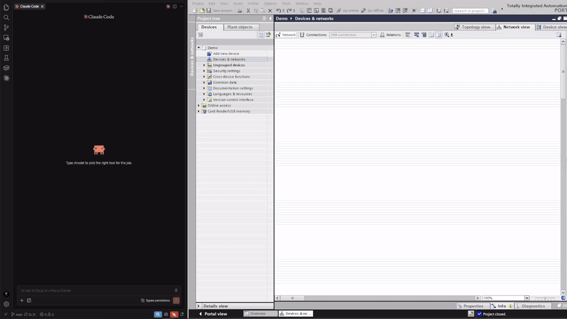
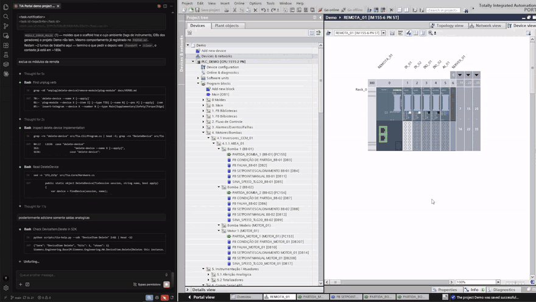
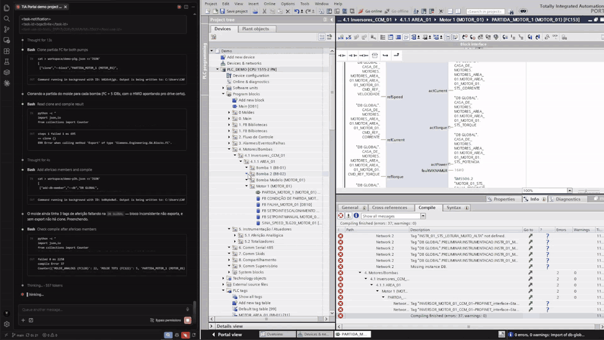
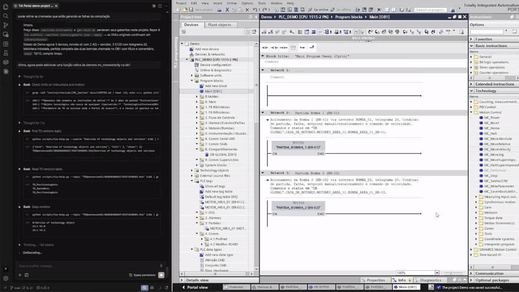
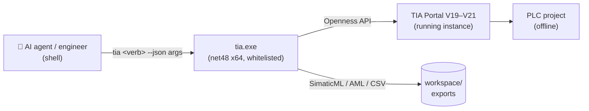

# ⚡ tia-cli — AI PLC programming for Siemens TIA Portal

**Let an AI agent program for you.**

*AI-assisted PLC programming on your own machine — S7-1500, S7-1200, ET 200, SINAMICS drives, WinCC
HMI, any device TIA Portal supports. 240+ command-line verbs over the Siemens Openness API, JSON in
and out, nothing written without an explicit `--apply`. Runs offline and on-premise — no cloud, no
account, your project never leaves your computer.*

**The source code is not public.** Want access, a licence, or a demo — **[contato@codyte.com](mailto:contato@codyte.com)**

- **Nothing is applied unless you say so.** Every write verb prints what it would change, as JSON, and acts only with `--apply`.
- **It stays on your machine.** Unlike cloud copilots such as Siemens Industrial Copilot, there is no cloud service behind it: no Azure tenant, no subscription, no project data sent anywhere.
- **Works with the agent you already use.** Claude Code, Codex, Cursor, Copilot — anything that can run a shell command.
- **Offline by design.** No go-online, no download to the PLC. Writing to a running plant stays a human job.

Independent project, **not affiliated with, authorised by, or endorsed by Siemens AG** — TIA
Portal, SIMATIC, SINAMICS, STEP 7 and Openness are trademarks of Siemens AG. Requires your own
licensed TIA Portal installation; no Siemens binary or data is distributed here.

---

## Watch it work

Three moments from one session on an empty project. The CLI drives, TIA Portal updates live.

I/O modules into the rack, two starters called from `Main [OB1]` in ladder. Compile: 0 errors, 0 warnings.

Blocks generated per pump, and the 10 `audit` checks grading what came out.

A SINAMICS drive joins PROFINET. Compile closes at `errors: 3` — the CLI shows what is missing instead of hiding it.

---

## An AI agent wrote a PLC program from scratch

The specification for a fictional machine and the pass/fail criteria were written **before** each
round, by someone who did not run it. The agent got the specification only, and delivered a **PLC
program that compiles**. The full write-up — the ruler used and the stumbles along the way — is
available on request.

---

## Verbs

161 verbs, all with JSON output.

| Group | | Verbs |
|---|--:|---|
| 🔌 Session & project | 5 | `open-project` · `create-project` · `save-project` · `close-project` · `archive-project` |
| 🔍 Read & orientation | 13 | **`tree`** *(start here)* · `info` · `list-devices` · `list-blocks` · `list-tags` · `list-types` · `find` · `xref` *(cross-reference)* · `trace` · `explain-block` · `list-interface` · `free-memory` · `snapshot` |
| 📤 Export & import | 10 | `export-block` · `import-block` · `export-tags` · `import-tags` · `export-type` · `import-type` · `import-source` · `export-doc` · `import-doc` · `export-cax` |
| 🗂️ Structure | 10 | `create-folder` · `delete-folder` · `delete-block` · `delete-type` · `create-instance-db` · `move-block` · `move-type` · `rename-block` · `clone` · `scaffold` |
| 🛠️ Hardware & network | 14 | `add-device` · `delete-device` · `plug-module` · `list-attrs` · `set-attr` · `list-io-map` · `set-io-address` · `set-address` · `list-net` · `connect-subnet` · `set-memory-bytes` · `import-cax` |
| ⚡ SINAMICS drives | 4 | `list-telegrams` · `insert-telegram` · `list-drive-params` · `set-drive-param` |
| ✍️ Block editing | 10 | `add-call` · `delete-network` · `add-db-member` · `edit-db-member` · `delete-db-member` · `add-fb-param` · `delete-fb-param` · `set-retain` · `compile` · `diff-block` |
| 🏷️ Tags | 3 | `add-tag` · `set-tag` · `delete-tag` |
| ⚙️ Code generation & audit | 8 | `gen-profinet` · `gen-fault-ob` · `gen-alarm-fc` · `replicate-fc` · `replicate-instruments` · `standardize-tags` · `doctor` · `audit` |
| 🖥️ HMI & screens | 11 | `list-hmi` · `hmi-tree` · `export-screen` · `import-screen` · `delete-screen` · `list-screen-items` · `set-screen-items` · `copy-screen-items` · `audit-screen` · `export-hmi-tags` · `import-hmi-tags` |
| 🎛️ Motion | 4 | `list-motion` · `create-motion` · `delete-motion` · `set-motion-param` |
| 👁️ Simulation & watch | 4 | `sim-run` · `sim-diag` · `list-watch-tables` · `set-watch-table` |
| 📚 Library | 8 | `list-library` · `create-library` · `retrieve-library` · `lib-update-check` · `import-master-copy` · `import-library-type` · `add-master-copy` · `delete-master-copy` |
| 📦 Batch & Multiuser | 2 | `run --script ops.json` *(dozens of verbs in a single attach)* · `list-server-projects` |

Global options: `--plc NAME`, `--portal PROJECT|PID` (required when more than one Portal is open),
`--out DIR`, `--apply`, `--out-file F.json`, `--retry N`, `--timeout SEC`.

## How it works

Headless TIA Portal scripting, from any shell. Otherwise, TIA Portal automation means clicking, or
writing a throwaway C# Openness app for every task — project discovery, attach, whitelist and XML
plumbing rewritten from scratch each time. `tia-cli` reduces that to one whitelisted exe: stdout is
always JSON, stderr is a human log, exit codes are stable, and a batch file runs dozens of verbs in
a single attach.

Every call attaches to a running Portal instance and works by XML round-trip: export SimaticML →
transform → import. The high-level verbs are built on top of that. One call at a time: Openness is
not thread-safe for this use.

Large output does not flood the terminal — `--out-file F.json` sends the full JSON to the file and
returns only `{file,bytes,count,head}` on stdout. That matters more than it sounds: on a 476-block
project, `find --pattern "*" --kind tag` is 821 KB, while `tree` answers most orientation questions
in 39 KB of markdown.

## Access and licensing

The repository is private and development continues there. Releases up to **v2.0.0** were published
under MIT and stay MIT — that grant is irrevocable, and anyone who obtained those versions keeps it.
Later versions are not distributed publicly.

Source access, a commercial licence, an evaluation build, or a live demo:
**[contato@codyte.com](mailto:contato@codyte.com)**
