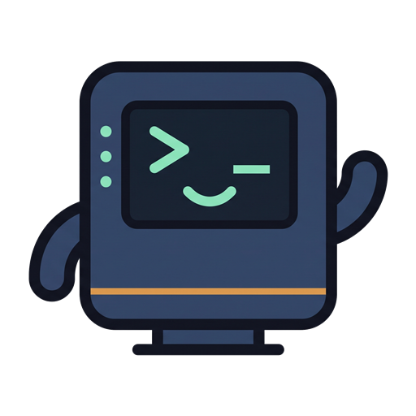
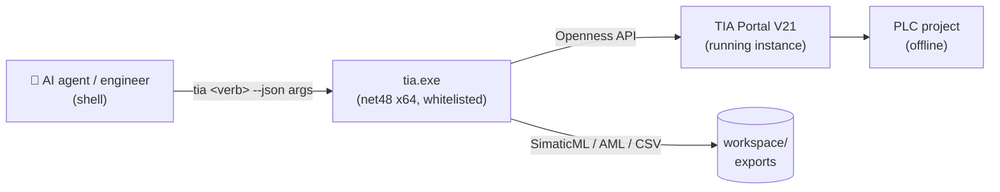

<div align="center">



# ⚡ tia-cli

**Drive Siemens TIA Portal from the command line — JSON in, JSON out.**

*Every Openness operation as a shell verb. Built for AI agents and for engineers
who prefer a terminal over ClickOps.*

[](https://github.com/Codyte/Tia-Portal-CLI/releases/latest)
[](https://github.com/Codyte/Tia-Portal-CLI/actions/workflows/ci.yml)
[](LICENSE)
[](https://dotnet.microsoft.com/)
[](https://www.siemens.com/tia-portal)
[](#requirements)
[](#design-contract)

### An engineering task, start to finish, without touching the mouse

**Every write is a dry-run until you type `--apply`.** That one property is what makes it safe to
hand the keys to an AI agent — and in blind end-to-end tests, an agent given nothing but a fictional
machine spec delivered a **compiling PLC program**. Spec and pass criteria were written before each
run, by someone who did not execute it: [`docs/teste-cego/`](docs/teste-cego/) — write-up in
Portuguese: [**the ruler and the stumbles**](docs/teste-cego/artigo.md).

**92 verbs** · inventory & xref · SimaticML export/import · hardware via CAx/AML, catalog modules
and SINAMICS telegrams · SCL→LAD converter · 6 field-proven code generators · installable block
library · batch mode · one attach

<sub>An independent open-source project. **Not affiliated with, authorized by, or endorsed by
Siemens AG.** TIA Portal, SIMATIC, SINAMICS, STEP 7 and Openness are trademarks of Siemens AG,
used here only to identify the software this tool drives. Requires your own licensed TIA Portal
installation — no Siemens binaries, libraries or project data are distributed in this
repository.</sub>

</div>

---

## Why

TIA Portal automation today means clicking, or writing a one-off C# Openness app per task —
project discovery, attach, whitelist and XML plumbing rewritten from scratch every time.
`tia-cli` collapses that into a single whitelisted exe: stdout is always JSON, stderr is human
log, exit codes are stable, and one batch file runs dozens of verbs on a single attach.



Extracted from field-proven automation scripts for water-treatment PLC projects
(`Scripts_Siemens/FINAIS/`, kept as read-only reference).

## What this project does not touch

Openness is Siemens' API, under Siemens' terms. This project stays on the documented side of it:

- **No Siemens binary is redistributed.** `Siemens.Engineering.dll` and its siblings are never
  committed. `init.ps1` copies them from *your* local TIA Portal installation into a gitignored
  `lib/`, and at runtime the exe resolves them from the installed Portal.
- **No reverse engineering, no bypass.** Everything goes through the public Openness API. The
  Windows `Siemens TIA Openness` group and the Openness whitelist (registry entry keyed by exe path
  and hash) are honored, not worked around — including the consent dialog the Portal raises after
  every rebuild.
- **No customer data.** Exported XML/AML carries equipment names, tags and DB structure, so it is
  gitignored by policy. What is versioned is either original or sanitized.
- **MIT**, and not affiliated with, endorsed by, or distributed by Siemens.

## Study before doing

An agent that starts typing SCL before knowing what the platform already offers writes worse code
than an engineer who reads first. So the toolchain answers that question in one call:

```powershell
python scripts/tia-help.py --study "5-axis arm that sorts parts"
```

Returns, for that topic: which F1 manual pages to open (`--topic` reads them as plain text), which
Openness API members exist, **which official Siemens library already solves it** (LGF, DriveLib),
the hardware constraint that would sink the project if found late (a coordinated multi-axis path
needs an S7-1500**T**), which house rules apply, and which verb comes next. When the topic matches
no domain, it still returns the platform catalog — the point is not knowing how to do everything,
it is knowing what exists and where to look.

Behind it: 45 518 F1 help topics, 31 448 documented Openness members, and a curated map in
[`docs/study-map.json`](docs/study-map.json) — a new domain is one more JSON object, no code change.
`--search` matches titles, `--deep` downloads and greps the bodies of the most plausible topics
(cached), `--sdk` matches API signatures and summaries.

See [`docs/GUIA-SIEMENS.md`](docs/GUIA-SIEMENS.md) for the official Siemens guideline and libraries,
and where this repo's own rules are deliberately stricter.

## Design contract

- **Dry-run by default.** Every write verb previews its changes as JSON; nothing mutates the
  project without an explicit `--apply`. An agent cannot wreck a project by accident.
- **Attach first.** The CLI attaches to the running TIA Portal instance (opening/creating
  projects is also supported: `open-project`, `create-project`, `save-project`, `close-project`).
- **Offline only — permanently, not "not yet".** No go-online, no download to PLC, no Multiuser
  check-in. `--apply` protects a project; it cannot protect a running plant, so writing to a PLC
  stays with a human looking at the screen. Compile is the only "heavy" operation exposed.
- **One call at a time.** Openness is not thread-safe for this use; never run two `tia`
  processes in parallel.
- **XML roundtrip as the core primitive.** Export SimaticML → transform → import. High-level
  verbs are built on top of it.

## Verbs

Run `tia --help` for the full, always-current list.

| Group | Verbs |
|-------|-------|
| 🔌 Session | `open-project` · `create-project` · `save-project` · `close-project` |
| 🔍 Read | **`tree`** (start here: whole-PLC outline as markdown) · `info` · `list-devices` · `list-blocks` (`--folder` · `--type` · `--count`) · `list-tags` · `list-types` · `list-hmi` · `list-motion` (technology objects: axes, cams, kinematics) · `find` · `snapshot` · `xref` · `trace` (every symbol of one equipment + who references it) · `explain-block` (LAD/FBD → compact text) · `free-memory` (free holes in `%M`) · `export-block` · `export-tags` · `export-type` |
| 🗂️ Structure | `create-folder` · `delete-folder` (`--tags`/`--types`) · `delete-block` · `delete-type` · `create-instance-db` · `move-block` (export→delete→import; Openness has no move) · `import-type` · `scaffold` (folder tree + template blocks from a manifest, idempotent) |
| 🛠️ Hardware | `add-device` · `delete-device` · `list-attrs` / `set-attr` (any device-item attribute) · `plug-module` (catalog submodules) · `list-telegrams` / `insert-telegram` (SINAMICS drives) · `set-address` · `list-io-map` / `set-io-address` (every I/O address in the project, and the one way to move one) · `connect-subnet` · `set-memory-bytes` (clock/system byte) · `export-cax` · `import-cax` (AML) |
| ✍️ Write | `import-block` · `import-source` · `import-ladder` (SCL subset → LAD) · `import-tags` · `add-tag` / `set-tag` / `delete-tag` · `rename-block` · `clone` · `add-db-member` / `edit-db-member` / `delete-db-member` · `compile` · `diff-block` |
| ⚙️ Generators | `gen-profinet` · `standardize-tags` · `gen-fault-ob` · `replicate-fc` · `gen-alarm-fc` · `replicate-instruments` — plus `doctor`, a read-only preflight that checks every template/folder they need, and `audit`, project × naming law |
| 📚 Library | `retrieve-library` (`.zal1x` → `.al2x`, how you consume Siemens' own free libraries — LGF, DriveLib — which SIOS ships archived) · `list-library` · `import-master-copy` · `add-master-copy` · `delete-master-copy` — a block library that travels as a single `.al21` and installs into a bare CPU in one command (see [`library/`](library/README.md); manifest is versioned, XML payload is not) |
| 👥 Multiuser | `list-server-projects` — read-only inventory of a TIA Project Server (locks, local sessions) |
| 📦 Batch | `run --script ops.json [--summary]` — array of verb calls, one attach for all; a failing step becomes `{ok:false,error}` and the batch keeps going |

Global options: `--plc NAME` (multi-PLC projects), `--portal PROJECT|PID` (required when more than
one Portal is open), `--out DIR` (default `workspace\exports`), `--apply`, `--retry N` (busy retry,
default 3), `--timeout SEC`.

`--out-file F.json` works on any read verb: the full JSON goes to the file and stdout returns only
`{file,bytes,count,head}`. That matters more than it sounds — on a real project `find --pattern "*"
--kind tag` is 821 KB, and `tree` answers most orientation questions in 39 KB of markdown instead.

Exit codes: `0` ok · `1` error · `2` usage · `3` file · `4` TIA/Openness · `5` timeout.
Full signatures: [`docs/VERBS.md`](docs/VERBS.md), generated from `--help`.

Generator configs are plain JSON — see [`docs/examples/`](docs/examples/), including
[`gen-all.json`](docs/examples/gen-all.json), a batch that dry-runs all six generators in one attach:

```powershell
tia run --script docs/examples/gen-all.json
```

## Quick start

**From a release — no .NET SDK needed.** Download the zip from
[Releases](https://github.com/Codyte/Tia-Portal-CLI/releases/latest), extract it anywhere, and:

```powershell
pwsh scripts/init.ps1           # skips the build gates: the exe is already there.
                                 # Registers the whitelist and puts `tia` on PATH.
pwsh scripts/init.ps1 -Check    # read-only report, exit 1 if a gate is missing
```

The zip carries **no Siemens binaries** — `tia.exe` resolves the Openness assemblies from your own
TIA Portal installation at runtime.

**From source** — needed to contribute, or to build against a Portal version other than the one
released:

```powershell
git clone https://github.com/Codyte/Tia-Portal-CLI.git tia-cli && cd tia-cli
pwsh scripts/init.ps1    # checks the 3 gates below, copies lib/ DLLs from your TIA install,
                          # builds, runs offline tests, whitelists, puts `tia` on PATH
                          # — one shot for a new machine
```

`init.ps1` is idempotent — re-run it after `git pull`. Besides the build it sets the `TIA_CLI_HOME`
user variable and adds `scripts/` to your user PATH, so `tia <verb>` works from any directory,
always through the session-routing shim (never call `tia.exe` directly). Keep a **single checkout**
— the Openness whitelist is keyed by the `tia.exe` path, so two clones fight over it.

The CLI is standalone: clone it anywhere and it works. It doubles as a Claude Code skill — the repo
root *is* the skill, and [`SKILL.md`](SKILL.md) teaches any session how to drive this CLI from any
project folder. For that one use, and only that, the checkout has to live at `~/.claude/skills/tia`
(clone it as a submodule of your skills repo); `init.ps1 -Check` reports where it is either way.

`init.ps1` reports and stops if a gate needs a human (Windows group membership, .NET SDK, or a
TIA Portal V21+ install to source the Openness DLLs from) — fix what it flags and re-run. Once it
prints `init ok`, open TIA Portal manually with a test project (`tia` attaches to a running
instance, it doesn't launch one) and:

```powershell
tia doctor                    # preflight: is the open project ready for the generators?
tia tree                      # whole-PLC outline as markdown — the cheapest way to get oriented
tia standardize-tags          # dry-run: what would change
tia standardize-tags --apply  # do it
```

**No project to try it on?** Build one from nothing — this needs only a Portal installation:

```powershell
tia --version                                          # CLI version + which Openness it loaded
tia create-project --dir C:\temp --name Demo           # opens the Portal on an empty project
tia add-device --mlfb "6ES7 515-2AN03-0AB0/V3.1" --name CPU1 --apply
tia tree                                               # the whole PLC as markdown
tia gen-fault-ob                                       # dry-run: what a generator would write
```

First attach without a whitelist entry triggers an Openness consent popup in the Portal UI —
click allow, it won't ask again for that exe hash. After this first-time setup, use
`pwsh scripts/rebuild.ps1` for subsequent rebuilds (same build+test+whitelist, skips the gate
checks and lib/ copy).

<details>
<summary><b>Requirements</b></summary>

- Windows, **TIA Portal V21** with Openness installed. V21 is the only supported version: the
  build references the split assemblies (`Siemens.Engineering.Base/Step7/WinCCUnified`) that V21
  introduced, so it does not even compile against the monolithic `Siemens.Engineering.dll` that
  V19/V20 ship. The runtime resolver still probes V20/V19 install paths, but that is a leftover,
  not a supported path — building for an older major needs conditional references and has never
  been done. `set-tag --rename` additionally requires Openness V20+.
- **To build from source**, S7-PLCSIM Advanced must be installed as well: `Sim.cs` compiles against
  its API. Running a release zip does **not** need it — the DLL is never distributed, and the exe
  resolves it from `Common Files\Siemens\PLCSIMADV\API` when a `sim-*` verb is called. Without
  PLCSIM installed, only those verbs fail.
- .NET Framework 4.8 (ships with Windows) to run. The .NET SDK 8 is needed **only to build from
  source** — the release zip carries a compiled `tia.exe`. Target is `net48` x64.
- `Siemens.Engineering.dll` is **not** in this repo (Siemens license). At build time a local
  copy under `lib/` (gitignored) is used; at runtime the exe resolves the DLL from the installed
  Portal (`TIA_ENGINEERING_DIR` env var → exe folder → default V21/V20/V19 install paths).

</details>

<details>
<summary><b>Setup — the three Openness gates</b></summary>

1. Your Windows user must be in the **`Siemens TIA Openness`** group — and you need a fresh
   logon after being added (an old token doesn't carry the group).
2. The exe must be **whitelisted** in the Openness registry
   (`HKLM\...\Openness\<ver>\Whitelist`): path, file hash and timestamp.
   `scripts/whitelist.ps1` writes the correct entry; re-run after every rebuild (hash changes).
   `scripts/rebuild.ps1` does build + tests + whitelist in one shot.
3. The CLI must run in the **same interactive session** as the TIA Portal UI (a service /
   scheduled-task session cannot attach).

First run against a Portal without whitelist entry triggers the Openness consent popup — allow it.

</details>

<details>
<summary><b>Workflow macros (PowerShell)</b></summary>

| Macro | Does |
|-------|------|
| `scripts/init.ps1` | first-time bootstrap: checks the 3 gates, copies `lib/` DLLs from the local TIA install, then rebuild |
| `scripts/rebuild.ps1` | build + offline tests + whitelist refresh |
| `scripts/use-project.ps1 <Name>` | ensure a project is open (no-op if already; close current without save + open) |
| `scripts/prep-project.ps1 <Name>` | use-project + `doctor` + `compile --apply` + save — real projects often arrive uncompiled and every export dies until compiled |
| `scripts/raio-x.ps1 <Name>` | read-only X-ray → `workspace/<project>/`: doctor, snapshot, devices, tags, types, block outline, CAx AML, xref of every OB |
| `scripts/clone-hw.ps1 <From> <To> [-Apply]` | copy hardware between projects via CAx export/import |
| `scripts/install-lib.ps1 "<Package>" -Plc X [-Apply]` | install library packages into a PLC from the `.al21` alone — clock byte, the package's hardware, base blocks, UDTs, tag tables, instance DBs, compile. Skips what already exists, so re-running is a no-op. No package name = list what's available |
| `scripts/bake-lib.ps1` | the inverse: PLC → `.al21`, so a library can be re-baked from a project that already carries it |
| `scripts/pack.ps1 [-Publish]` | build the release zip from the local build (no Siemens binaries; only Git-tracked files go in) |

</details>

<details>
<summary><b>Limitations</b></summary>

- No online operations — a closed decision, not a roadmap item (see *Design contract*).
- WinCC Unified screens can't be exported/imported as XML — Openness doesn't expose SimaticML
  for Unified. `list-hmi` covers inventory only.
- Multiuser projects: attach works single-user style; check-in stays in the Portal.
- `import-ladder` converts a deliberate SCL subset (bool logic, comparators, Set/Reset/MOVE);
  it rejects anything else with a clear error.
- Openness refuses to export an inconsistent block, and every import leaves its target (and any
  block referencing it) inconsistent. So compile between steps — `clone`, `diff-block` and
  `explain-block` all export under the hood, and the generators export the global DB first.
  The CLI turns the bare Openness message into the exact `tia compile` command to run.

</details>

## Docs

- [`docs/BENCHMARKS.md`](docs/BENCHMARKS.md) — measured time-to-answer per verb, what one attach
  saves, output volume, and a real captured cycle. English.
- [`docs/VERBS.md`](docs/VERBS.md) — full signatures, generated from `--help`. English.
- [`CHANGELOG.md`](CHANGELOG.md) — what changed per release, including what is deliberately absent.
- [`CONTRIBUTING.md`](CONTRIBUTING.md) — how to build and what a PR has to prove. Read the first
  section before opening one: **CI cannot build this project**, because the Openness assemblies are
  licensed and exist on no runner. Verification is what you ran locally.
- [`SECURITY.md`](SECURITY.md) — what counts as a security issue in an offline engineering CLI.
- The rest of [`docs/`](docs/) is Portuguese (plan, decisions, real-project findings). Code and CLI
  are English.

## License

[MIT](LICENSE). *TIA Portal*, *Openness* and `Siemens.Engineering.dll` are Siemens products —
not affiliated with, endorsed by, or distributed by this project.
