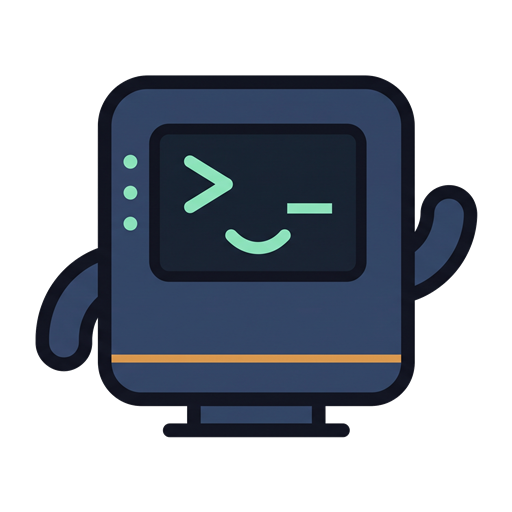
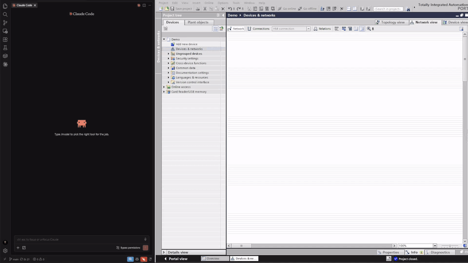
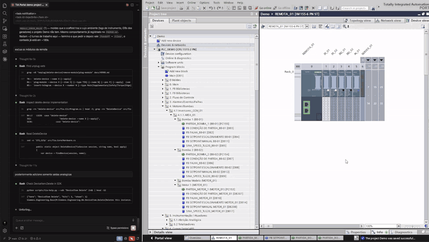
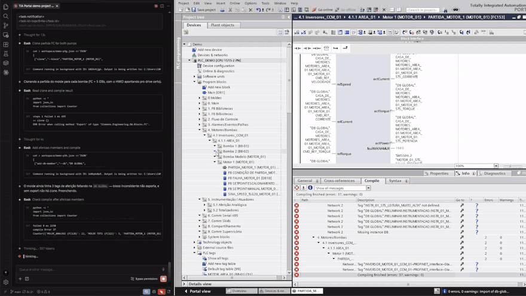
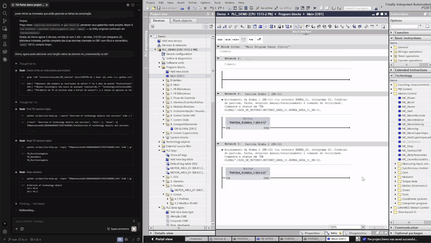
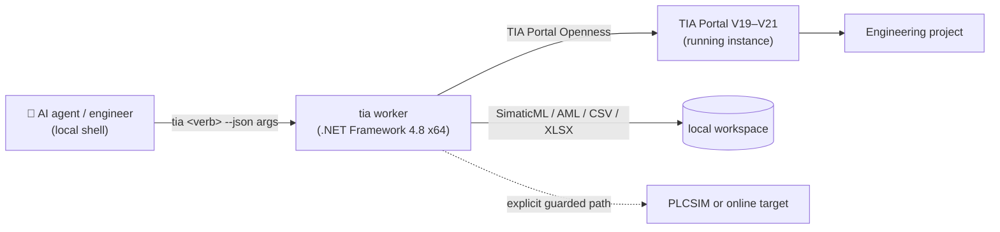

<div align="center">



# ⚡ tia-cli — AI-assisted PLC engineering for Siemens TIA Portal

**A local, deterministic command line between an AI agent and TIA Portal Openness.**

*Inspect, generate and change PLC, hardware, drive, HMI, Safety, Multiuser and online engineering
objects through 347 JSON verbs. Nothing is sent to a cloud service, and project writes are previews
until an explicit `--apply`.*




[](LICENSE)
[](https://dotnet.microsoft.com/)


**This repository is the public product showcase. The current source and binaries are private.**

For source access, an evaluation build, a commercial licence or a live demo:
**[contato@codyte.com](mailto:contato@codyte.com)**

</div>

- **Dry-run is the default.** Write verbs return the proposed change and act only with `--apply`.
- **Local and on-premise.** The agent, CLI, TIA Portal and project stay on the engineering machine.
- **Agent-neutral.** Codex, Claude Code, Cursor, Copilot or any process that can run a command and
  read JSON can use it; there is no required editor extension or hosted agent service.
- **Online access is explicit and guarded.** Discovery is read-only. Online writes require
  `--apply`; a physical interface additionally requires `--allow-physical`. `sim-run` is restricted
  to S7-PLCSIM Advanced.
- **The API boundary is respected.** It uses Siemens TIA Portal Openness and the normal Windows
  group, executable whitelist and consent flow—no UI scraping or protection bypass.

**Supported engineering environment:** Windows x64 with a licensed TIA Portal V19, V20 or V21
installation. A version-specific worker is built against the PublicAPI assemblies installed on that
machine, so optional capabilities fail explicitly instead of silently crossing Portal versions.

<sub>Independent project, <strong>not affiliated with, authorised by, or endorsed by Siemens
AG</strong>. TIA Portal, SIMATIC, SINAMICS, STEP 7 and Openness are trademarks of Siemens AG. The
product requires the customer's own licensed Siemens installation; no Siemens binary or customer
project data is distributed here.</sub>

---

## Watch it work

Three moments from one agent session on an empty project. The CLI drives; TIA Portal updates live.



<sub>I/O modules are added to the rack and two starters are called from `Main [OB1]` in ladder.
Compile result: 0 errors, 0 warnings.</sub>



<sub>Blocks are generated per pump and the audit checks grade the result.</sub>



<sub>A SINAMICS drive joins PROFINET. The compile closes with three errors, and the CLI reports what
is missing instead of hiding an incomplete result.</sub>

---

## What it covers

The current v3 surface contains **347 command-line verbs**, all with structured JSON output and
stable exit codes. Representative areas:

| Area | Examples |
|---|---|
| Project orientation | `env`, `info`, `tree`, `find`, `xref`, `reachable`, `unused`, `trace` |
| PLC software | blocks, interfaces, DB members, tags, UDTs, sources, LAD calls, compile and diff |
| Hardware and networks | devices, modules, racks, I/O addresses, subnets, PROFINET and CAx/AML |
| SINAMICS and starters | telegrams, drive parameters, generated starter logic and simulation scenarios |
| WinCC Classic | screens, scripts, tags, connections, text lists, templates and screen-object audits |
| WinCC Unified | screens, items, tags, connections, alarms, events, named objects and runtime settings |
| Safety | F-program information, runtime groups, settings, signatures, printouts and validation tests |
| Motion | technology objects, cams, interpreter programs and mappings |
| Libraries | global libraries, master copies, types, packages and repeatable installation workflows |
| Multiuser | Project Server discovery, local sessions, marking, commit and check-in |
| Online and simulation | target discovery, online/offline, compare, download/upload and PLCSIM Advanced |
| Batch and audit | checked step files, transactions, rehearsal/rollback, compile and acceptance audits |

See [the public capability map](docs/CAPABILITIES.md) for the operating model, safety boundaries and
more representative commands.

## An AI agent wrote a PLC program from scratch

For the blind engineering tests, the machine specification and pass/fail ruler were frozen before
each round by someone who did not execute the work. The agent received only that specification and
delivered a PLC program that compiled. The result includes the acceptance evidence and the failures
encountered along the way; the full test pack is available with a product demo.

The useful distinction is simple: the model chooses the engineering operation, while deterministic
C# code performs the Openness call and returns machine-checkable evidence. The model does not click
through Portal dialogs or invent an unverified success.

## How an agent uses it

The installed product exposes one `tia` shim on `PATH`:

```powershell
tia env                              # Portal processes, products and options; no attach
tia tree                             # compact PLC map; read-only
tia standardize-tags                 # preview only
tia standardize-tags --apply         # explicit project write
tia compile --apply                  # compile and return structured messages
```

For multi-step work, the agent maps the project, studies the relevant engineering rules, validates a
batch offline, rehearses it when possible, then applies that same reviewed batch with compile and
audit as acceptance steps. A single Openness session executes the sequence; concurrent Portal calls
are refused.

Large results can be written to a file while stdout receives only a bounded digest. Agent mode also
provides a fixed envelope—`{verb, ok, action, data, warnings, next, ms}`—so automation does not have
to scrape human console text.

## How it works


```mermaid
flowchart LR
    A["🤖 AI agent / engineer<br/>(local shell)"] -->|"tia &lt;verb&gt; --json args"| B["tia worker<br/>(.NET Framework 4.8 x64)"]
    B -->|"TIA Portal Openness"| C["TIA Portal V19–V21<br/>(running instance)"]
    B -->|"SimaticML / AML / CSV / XLSX"| D[("local workspace")]
    C --> E["Engineering project"]
    B -. explicit guarded path .-> F["PLCSIM or online target"]
```

The shim selects the worker compiled for the target Portal major. The worker attaches through
Openness, uses typed APIs or controlled SimaticML/AML round trips, and returns JSON on stdout with a
stable process exit code. Ring-0 diagnostics such as `env`, `licenses` and `sim-diag` do not attach
to Portal; engineering verbs serialize access to the single Openness session.

## Safety boundaries

- Project-changing verbs are dry-run unless `--apply` is present. Lifecycle operations are
  explicitly documented exceptions because opening, saving or closing is their purpose.
- Destructive replacement workflows create a local recovery export first when the API permits it;
  that safety net does not replace a project backup.
- Physical online access is never implicit: a write needs `--apply`, and a physical interface needs
  the additional `--allow-physical` opt-in. `sim-run` refuses a real CPU.
- The product sends no telemetry or project content to a hosted service. Optional Project Server
  access goes only to the server named by the operator; local telemetry, when enabled, stays local.
- Openness limitations are reported as capability errors. The CLI does not work around unavailable
  APIs by automating the GUI.

Please report a suspected vulnerability privately as described in [SECURITY.md](SECURITY.md).

## Access and licensing

The current product is **v3.0.0**. Its source code and distributable builds are not published in
this showcase repository.

Copyright (c) 2026 Codyte.

Current versions are available under **AGPL-3.0** or a separate commercial licence. Using the CLI
internally on your own engineering projects does not by itself distribute the software. A commercial
licence without copyleft obligations is available for organizations that need it.

Releases through **v2.0.0** were published under MIT and remain MIT; that historical grant is
irrevocable. It does not make later private versions or their source part of this repository.

For evaluation, licensing, source access, integration work or a live demonstration, contact
**[contato@codyte.com](mailto:contato@codyte.com)**.
