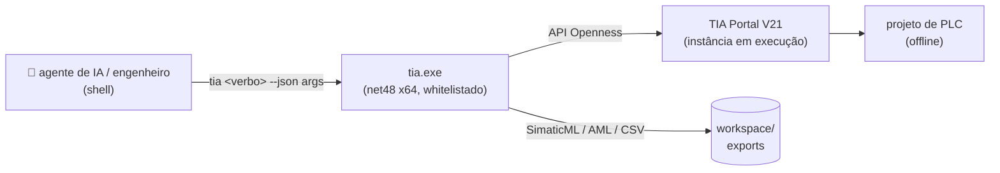

<div align="center">


# ⚡ tia-cli

**Dirija o TIA Portal da Siemens pela linha de comando — JSON na entrada, JSON na saída.**

*Cada operação do Openness como um verbo de shell. Feito para agentes de IA e para engenheiros
que preferem um terminal a ClickOps.*

[](https://github.com/Codyte/Tia-Portal-CLI/releases/latest)
[](https://github.com/Codyte/Tia-Portal-CLI/actions/workflows/ci.yml)
[](LICENSE)
[](https://dotnet.microsoft.com/)
[](https://www.siemens.com/tia-portal)
[](#requisitos)
[](#contrato-de-projeto)

**[English](README.md)** · Português (Brasil)

### Uma tarefa de engenharia, do início ao fim, sem tocar no mouse

**Toda escrita é dry-run até você digitar `--apply`.** Essa única propriedade é o que torna seguro
entregar as chaves a um agente de IA — e, em testes cegos de ponta a ponta, um agente que recebeu
apenas a especificação de uma máquina fictícia entregou um **programa de PLC que compila**. A
especificação e os critérios de aprovação foram escritos antes de cada rodada, por quem não a
executou: [`docs/teste-cego/`](docs/teste-cego/) — relato completo:
[**a régua e os tropeços**](docs/teste-cego/artigo.md).

**95 verbos** · inventário e referências cruzadas · exportação/importação SimaticML · hardware via
CAx/AML, módulos de catálogo e telegramas SINAMICS · conversor SCL→LAD · 6 geradores de código
validados em campo · biblioteca de blocos instalável · modo batch · um único attach

<sub>Projeto independente de código aberto. **Sem vínculo, autorização ou endosso da Siemens AG.**
TIA Portal, SIMATIC, SINAMICS, STEP 7 e Openness são marcas da Siemens AG, usadas aqui apenas para
identificar o software que esta ferramenta dirige. Exige a sua própria instalação licenciada do TIA
Portal — nenhum binário, biblioteca ou dado de projeto da Siemens é distribuído neste
repositório.</sub>

</div>

---

## Por quê

Automatizar o TIA Portal hoje significa clicar, ou escrever um aplicativo C# de Openness descartável
para cada tarefa — descoberta de projeto, attach, whitelist e o encanamento de XML reescritos do zero
toda vez. O `tia-cli` reduz isso a um único exe whitelistado: o stdout é sempre JSON, o stderr é log
para humano, os códigos de saída são estáveis, e um arquivo de batch roda dezenas de verbos em um
único attach.



Extraído de scripts de automação validados em campo, de projetos de PLC para tratamento de água
(`Scripts_Siemens/FINAIS/`, mantidos como referência somente leitura).

## No que este projeto não mexe

O Openness é a API da Siemens, sob os termos da Siemens. Este projeto fica do lado documentado dela:

- **Nenhum binário da Siemens é redistribuído.** A `Siemens.Engineering.dll` e suas irmãs nunca são
  commitadas. O `init.ps1` as copia da *sua* instalação local do TIA Portal para uma pasta `lib/`
  gitignored, e em tempo de execução o exe as resolve a partir do Portal instalado.
- **Nada de engenharia reversa, nada de contorno.** Tudo passa pela API pública do Openness. O grupo
  do Windows `Siemens TIA Openness` e a whitelist do Openness (entrada de registro indexada por
  caminho e hash do exe) são respeitados, não contornados — inclusive o diálogo de consentimento que
  o Portal levanta depois de cada rebuild.
- **Nenhum dado de cliente.** O XML/AML exportado carrega nomes de equipamento, tags e estrutura de
  DB, então é gitignored por política. O que é versionado é original ou está sanitizado.
- **MIT**, e sem vínculo, endosso ou distribuição pela Siemens.

## Estude antes de fazer

Um agente que começa a digitar SCL antes de saber o que a plataforma já oferece escreve código pior
que um engenheiro que lê primeiro. Então a ferramenta responde essa pergunta em uma chamada:

```powershell
python scripts/tia-help.py --study "braço de 5 eixos que separa peças"
```

Devolve, para o tema: quais páginas do manual F1 abrir (`--topic` as lê como texto puro), quais
membros da API Openness existem, **qual biblioteca oficial da Siemens já resolve** (LGF, DriveLib),
a restrição de hardware que afundaria o projeto se descoberta tarde (uma trajetória coordenada de
múltiplos eixos exige uma S7-1500**T**), quais regras da casa se aplicam e qual verbo vem em
seguida. Quando o tema não casa com domínio nenhum, ainda devolve o catálogo da plataforma — o
ponto não é saber fazer tudo, é saber o que existe e onde procurar.

Por trás disso: 45 518 tópicos da ajuda F1, 31 448 membros documentados do Openness e um mapa curado
em [`docs/study-map.json`](docs/study-map.json) — um domínio novo é mais um objeto JSON, nenhuma
linha de código muda. `--search` casa títulos, `--deep` baixa e grepa o corpo dos tópicos mais
plausíveis (com cache), `--sdk` casa assinaturas e descrições da API.

Veja [`docs/GUIA-SIEMENS.md`](docs/GUIA-SIEMENS.md) para o guia e as bibliotecas oficiais da
Siemens, e para onde as regras deste repositório são deliberadamente mais estritas.

## Contrato de projeto

- **Dry-run por padrão.** Todo verbo de escrita mostra suas mudanças como JSON; nada altera o
  projeto sem um `--apply` explícito. Um agente não consegue destruir um projeto por acidente.
- **Attach primeiro.** O CLI se anexa à instância do TIA Portal em execução (abrir e criar projetos
  também é suportado: `open-project`, `create-project`, `save-project`, `close-project`).
- **Somente offline — de forma permanente, não "ainda não".** Sem go-online, sem download para o
  PLC, sem check-in de Multiuser. O `--apply` protege um projeto; ele não consegue proteger uma
  planta em operação, então escrever num PLC continua com um humano olhando para a tela. Compilar é
  a única operação "pesada" exposta.
- **Uma chamada por vez.** O Openness não é thread-safe para este uso; nunca rode dois processos
  `tia` em paralelo.
- **Round-trip de XML como primitiva central.** Exportar SimaticML → transformar → importar. Os
  verbos de alto nível são construídos em cima disso.

## Verbos

Rode `tia --help` para a lista completa e sempre atual.

| Grupo | Verbos |
|-------|--------|
| 🔌 Sessão | `open-project` · `create-project` · `save-project` · `close-project` |
| 🔍 Leitura | **`tree`** (comece aqui: o PLC inteiro em markdown) · `info` · `list-devices` · `list-blocks` (`--folder` · `--type` · `--count`) · `list-tags` · `list-types` · `list-hmi` · `list-motion` (objetos tecnológicos: eixos, cames, cinemáticas) · `find` · `snapshot` · `xref` · `trace` (todo símbolo de um equipamento + quem o referencia) · `explain-block` (LAD/FBD → texto compacto) · `free-memory` (buracos livres em `%M`) · `export-block` · `export-tags` · `export-type` |
| 🗂️ Estrutura | `create-folder` · `delete-folder` (`--tags`/`--types`) · `delete-block` · `delete-type` · `create-instance-db` · `move-block` (export→delete→import; o Openness não move) · `import-type` · `scaffold` (árvore de pastas + blocos-modelo a partir de um manifesto, idempotente) |
| 🛠️ Hardware | `add-device` · `delete-device` · `list-attrs` / `set-attr` (qualquer atributo de device item) · `plug-module` (submódulos de catálogo) · `list-telegrams` / `insert-telegram` (drives SINAMICS) · `set-address` · `list-io-map` / `set-io-address` (todo endereço de I/O do projeto, e a única forma de mover um) · `connect-subnet` · `set-memory-bytes` (byte de clock/sistema) · `export-cax` · `import-cax` (AML) |
| ✍️ Escrita | `import-block` · `import-source` · `import-ladder` (subconjunto de SCL → LAD) · `import-tags` · `add-tag` / `set-tag` / `delete-tag` · `rename-block` · `clone` · `add-db-member` / `edit-db-member` / `delete-db-member` · `compile` · `diff-block` |
| ⚙️ Geradores | `gen-profinet` · `standardize-tags` · `gen-fault-ob` · `replicate-fc` · `gen-alarm-fc` · `replicate-instruments` — mais `doctor`, um preflight somente leitura que confere todo modelo/pasta de que eles precisam, e `audit`, projeto × lei de nomenclatura |
| 📚 Biblioteca | `retrieve-library` (`.zal1x` → `.al2x`, é assim que se consome as bibliotecas gratuitas da própria Siemens — LGF, DriveLib — que o SIOS entrega arquivadas) · `list-library` · `import-master-copy` · `add-master-copy` · `delete-master-copy` — uma biblioteca de blocos que viaja como um único `.al21` e se instala numa CPU virgem em um comando (veja [`library/`](library/README.md); o manifesto é versionado, o payload XML não) |
| 👥 Multiuser | `list-server-projects` — inventário somente leitura de um TIA Project Server (locks, sessões locais) |
| 📦 Batch | `run --script ops.json [--summary] [--fail-fast]` — array de chamadas de verbo, um attach para todas; um step que falha vira `{ok:false,error}` e o batch segue, ou para na primeira falha com `--fail-fast` |

Opções globais: `--plc NOME` (projetos com múltiplos PLCs), `--portal PROJETO|PID` (obrigatório
quando há mais de um Portal aberto), `--out DIR` (padrão `workspace\exports`), `--apply`,
`--retry N` (retentativa por ocupado, padrão 3), `--timeout SEG`.

O que o `--force` apaga é exportado para `workspace/recovery/<verbo>-<timestamp>/` antes da
remoção, e o caminho volta em `recoveryDir`. Um backup que falha aborta a remoção; `--no-backup` é
a saída explícita. Não há rollback automático — o XML salvo é o que o `import-block` relê.

`--out-file F.json` funciona em qualquer verbo de leitura: o JSON completo vai para o arquivo e o
stdout devolve só `{file,bytes,count,head}`. Isso importa mais do que parece — num projeto real
`find --pattern "*" --kind tag` são 821 KB, e o `tree` responde a maioria das perguntas de
orientação em 39 KB de markdown.

Códigos de saída: `0` ok · `1` erro · `2` uso · `3` arquivo · `4` TIA/Openness · `5` timeout.
Assinaturas completas: [`docs/VERBS.md`](docs/VERBS.md), gerado a partir do `--help`.

As configurações dos geradores são JSON puro — veja [`docs/examples/`](docs/examples/), inclusive
[`gen-all.json`](docs/examples/gen-all.json), um batch que roda os seis geradores em dry-run num
único attach:

```powershell
tia run --script docs/examples/gen-all.json
```

## Início rápido

**A partir de uma release — sem precisar do SDK do .NET.** Baixe o zip em
[Releases](https://github.com/Codyte/Tia-Portal-CLI/releases/latest), extraia em qualquer lugar e:

```powershell
pwsh scripts/init.ps1           # pula os gates de build: o exe já está lá.
                                 # Registra a whitelist e põe o `tia` no PATH.
pwsh scripts/init.ps1 -Check    # relatório somente leitura, exit 1 se faltar um gate
```

O zip **não carrega binários da Siemens** — o `tia.exe` resolve as assemblies do Openness a partir
da sua própria instalação do TIA Portal em tempo de execução.

**A partir do código-fonte** — necessário para contribuir, ou para compilar contra uma versão do
Portal diferente da que foi publicada:

```powershell
git clone https://github.com/Codyte/Tia-Portal-CLI.git tia-cli && cd tia-cli
pwsh scripts/init.ps1    # confere os 3 gates abaixo, copia as DLLs para lib/ da sua instalação
                          # do TIA, compila, roda os testes offline, whitelista, põe o `tia` no PATH
                          # — tudo de uma vez, para uma máquina nova
```

O `init.ps1` é idempotente — rode de novo depois de um `git pull`. Além do build, ele grava a
variável de usuário `TIA_CLI_HOME` e acrescenta `scripts/` ao seu PATH, então `tia <verbo>` funciona
de qualquer diretório, sempre através do shim que roteia por sessão (nunca chame o `tia.exe`
direto). Mantenha um **único checkout** — a whitelist do Openness é indexada pelo caminho do
`tia.exe`, então dois clones brigam por ela.

O CLI é autônomo: clone em qualquer lugar e funciona. Ele também serve como skill do Claude Code —
a raiz do repositório *é* a skill, e o [`SKILL.md`](SKILL.md) ensina qualquer sessão a dirigir este
CLI a partir de qualquer pasta de projeto. Para esse uso, e só para ele, o checkout precisa ficar em
`~/.claude/skills/tia` (clone como submódulo do seu repositório de skills); o `init.ps1 -Check`
informa onde ele está de qualquer jeito.

O `init.ps1` avisa e para se um gate precisar de um humano (participação no grupo do Windows, SDK do
.NET, ou uma instalação do TIA Portal V21+ de onde tirar as DLLs do Openness) — resolva o que ele
apontar e rode de novo. Assim que imprimir `init ok`, abra o TIA Portal manualmente com um projeto de
teste (o `tia` se anexa a uma instância em execução, ele não inicia uma) e:

```powershell
tia doctor                    # preflight: o projeto aberto está pronto para os geradores?
tia tree                      # o PLC inteiro em markdown — a forma mais barata de se orientar
tia standardize-tags          # dry-run: o que mudaria
tia standardize-tags --apply  # faz
```

**Sem projeto para testar?** Construa um do zero — isto exige apenas uma instalação do Portal:

```powershell
tia --version                                          # versão do CLI + qual Openness ele carregou
tia create-project --dir C:\temp --name Demo           # abre o Portal num projeto vazio
tia add-device --mlfb "6ES7 515-2AN03-0AB0/V3.1" --name CPU1 --apply
tia tree                                               # o PLC inteiro em markdown
tia gen-fault-ob                                       # dry-run: o que um gerador escreveria
```

O primeiro attach sem entrada na whitelist dispara um popup de consentimento do Openness na
interface do Portal — clique em permitir, ele não perguntará de novo para aquele hash de exe. Depois
dessa configuração inicial, use `pwsh scripts/rebuild.ps1` para os rebuilds seguintes (mesmo
build+testes+whitelist, pulando a checagem de gates e a cópia da `lib/`).

<details>
<summary><b>Requisitos</b></summary>

- Windows, **TIA Portal V21** com o Openness instalado. V21 é a única versão suportada: o build
  referencia as assemblies separadas (`Siemens.Engineering.Base/Step7/WinCCUnified`) que a V21
  introduziu, então ele nem sequer compila contra a `Siemens.Engineering.dll` monolítica que a
  V19/V20 entrega. O resolvedor de runtime ainda procura nos caminhos de instalação da V20/V19, mas
  isso é resquício, não caminho suportado — compilar para uma major mais antiga exigiria referências
  condicionais e nunca foi feito. O `set-tag --rename` exige adicionalmente Openness V20+.
- **Para compilar a partir do código-fonte**, o S7-PLCSIM Advanced também precisa estar instalado:
  o `Sim.cs` compila contra a API dele. Rodar um zip de release **não** exige isso — a DLL nunca é
  distribuída, e o exe a resolve em `Common Files\Siemens\PLCSIMADV\API` quando um verbo `sim-*` é
  chamado. Sem o PLCSIM instalado, apenas esses verbos falham.
- .NET Framework 4.8 (vem com o Windows) para rodar. O SDK do .NET 8 é necessário **apenas para
  compilar a partir do código-fonte** — o zip de release carrega um `tia.exe` já compilado. O alvo é
  `net48` x64.
- A `Siemens.Engineering.dll` **não** está neste repositório (licença Siemens). Em tempo de build usa-se
  uma cópia local em `lib/` (gitignored); em tempo de execução o exe resolve a DLL a partir do Portal
  instalado (variável de ambiente `TIA_ENGINEERING_DIR` → pasta do exe → caminhos padrão de
  instalação V21/V20/V19).

</details>

<details>
<summary><b>Instalação — os três gates do Openness</b></summary>

1. Seu usuário do Windows precisa estar no grupo **`Siemens TIA Openness`** — e é preciso um logon
   novo depois de ser adicionado (um token antigo não carrega o grupo).
2. O exe precisa estar **whitelistado** no registro do Openness
   (`HKLM\...\Openness\<ver>\Whitelist`): caminho, hash do arquivo e timestamp.
   O `scripts/whitelist.ps1` grava a entrada correta; rode de novo depois de cada rebuild (o hash
   muda). O `scripts/rebuild.ps1` faz build + testes + whitelist de uma vez.
3. O CLI precisa rodar na **mesma sessão interativa** que a interface do TIA Portal (uma sessão de
   serviço ou de tarefa agendada não consegue fazer attach).

A primeira execução contra um Portal sem entrada na whitelist dispara o popup de consentimento do
Openness — permita.

</details>

<details>
<summary><b>Macros de fluxo (PowerShell)</b></summary>

| Macro | O que faz |
|-------|-----------|
| `scripts/init.ps1` | bootstrap inicial: confere os 3 gates, copia as DLLs para `lib/` da instalação local do TIA, depois rebuild |
| `scripts/rebuild.ps1` | build + testes offline + atualização da whitelist |
| `scripts/use-project.ps1 <Nome>` | garante que um projeto está aberto (no-op se já estiver; fecha o atual sem salvar e abre) |
| `scripts/prep-project.ps1 <Nome>` | use-project + `doctor` + `compile --apply` + salvar — projetos reais costumam chegar sem compilar, e toda exportação morre até que se compile |
| `scripts/raio-x.ps1 <Nome>` | raio-x somente leitura → `workspace/<projeto>/`: doctor, snapshot, devices, tags, tipos, mapa de blocos, AML do CAx, xref de todo OB |
| `scripts/clone-hw.ps1 <De> <Para> [-Apply]` | copia hardware entre projetos via exportação/importação CAx |
| `scripts/install-lib.ps1 "<Pacote>" -Plc X [-Apply]` | instala pacotes da biblioteca num PLC a partir do `.al21` sozinho — byte de clock, o hardware do pacote, blocos-base, UDTs, tabelas de tag, DBs de instância, compilação. Pula o que já existe, então repetir é no-op. Sem nome de pacote = lista o que está disponível |
| `scripts/bake-lib.ps1` | o inverso: PLC → `.al21`, para que uma biblioteca possa ser reassada a partir de um projeto que já a carrega |
| `scripts/pack.ps1 [-Publish]` | monta o zip de release a partir do build local (sem binários da Siemens; só arquivos rastreados pelo Git entram) |

</details>

<details>
<summary><b>Limitações</b></summary>

- Nenhuma operação online — decisão fechada, não item de roadmap (veja *Contrato de projeto*).
- Telas do WinCC Unified não podem ser exportadas/importadas como XML — o Openness não expõe
  SimaticML para o Unified. O `list-hmi` cobre apenas inventário.
- Projetos Multiuser: o attach funciona no estilo single-user; o check-in continua no Portal.
- O `import-ladder` converte um subconjunto deliberado de SCL (lógica booleana, comparadores,
  Set/Reset/MOVE); ele recusa qualquer outra coisa com um erro claro.
- O Openness recusa exportar um bloco inconsistente, e toda importação deixa o alvo (e qualquer bloco
  que o referencie) inconsistente. Então compile entre as etapas — `clone`, `diff-block` e
  `explain-block` exportam por baixo dos panos, e os geradores exportam a DB global primeiro. O CLI
  transforma a mensagem crua do Openness no comando `tia compile` exato a ser executado.

</details>

## Documentação

- [`docs/BENCHMARKS.md`](docs/BENCHMARKS.md) — tempo medido até a resposta por verbo, o que um attach
  economiza, volume de saída e um ciclo real capturado. Em inglês.
- [`docs/VERBS.md`](docs/VERBS.md) — assinaturas completas, geradas a partir do `--help`. Em inglês.
- [`CHANGELOG.md`](CHANGELOG.md) — o que mudou em cada release, inclusive o que está deliberadamente
  ausente.
- [`CONTRIBUTING.md`](CONTRIBUTING.md) — como compilar e o que um PR precisa provar. Leia a primeira
  seção antes de abrir um: **a CI não consegue compilar este projeto**, porque as assemblies do
  Openness são licenciadas e não existem em runner nenhum. A verificação é o que você rodou
  localmente.
- [`SECURITY.md`](SECURITY.md) — o que conta como problema de segurança num CLI de engenharia
  offline.
- O restante de [`docs/`](docs/) está em português (plano, decisões, achados de projeto real). O
  código e o CLI são em inglês.

## Licença

[MIT](LICENSE). *TIA Portal*, *Openness* e `Siemens.Engineering.dll` são produtos da Siemens — sem
vínculo, endosso ou distribuição por este projeto.
