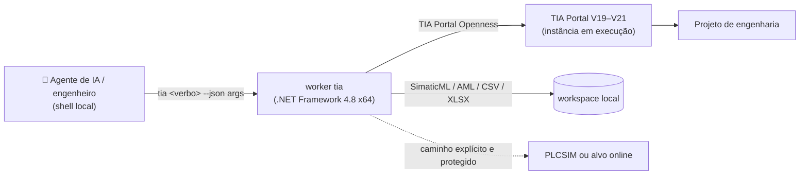

<!-- ====================== BEGIN NAV INDEX ====================== -->
<!-- NAV INDEX — auto-generated symbol map (refresh via the navindex skill) -->
<!--   L19     3.0K  ⚡ tia-cli — engenharia de CLP com IA para Siemens TIA Portal -->
<!--   L69     1.0K  Veja funcionando -->
<!--   L89     1.5K  O que ele cobre -->
<!--   L112    747B  Um agente de IA escreveu um programa de CLP do zero -->
<!--   L123    1.1K  Como um agente usa o produto -->
<!--   L144    855B  Como funciona -->
<!--   L160    994B  Limites de segurança -->
<!--   L175    861B  Acesso e licenciamento -->
<!-- ======================= END NAV INDEX ======================= -->

> Traduzido de [README.md](README.md). **O inglês é a referência** — em caso de divergência, vale a versão em inglês.

<div align="center">


# ⚡ tia-cli — engenharia de CLP com IA para Siemens TIA Portal

**Uma linha de comando local e determinística entre um agente de IA e o TIA Portal Openness.**

*Inspecione, gere e altere objetos de CLP, hardware, acionamentos, IHM, Safety, Multiuser e engenharia
online por meio de 347 verbos JSON. Nada é enviado para um serviço em nuvem, e escritas no projeto
são apenas prévias até um `--apply` explícito.*


[](LICENSE)
[](https://dotnet.microsoft.com/)


<!-- langs -->
**[English](README.md)** · Português (Brasil) · **[Deutsch](README.de.md)**
<!-- /langs -->

**Este repositório é a vitrine pública do produto. O código-fonte e os binários atuais são privados.**

Para acesso ao código, build de avaliação, licença comercial ou demonstração ao vivo:
**[contato@codyte.com](mailto:contato@codyte.com)**

</div>

- **Dry-run é o padrão.** Verbos de escrita retornam a alteração proposta e só agem com `--apply`.
- **Local e on-premise.** O agente, o CLI, o TIA Portal e o projeto ficam na máquina de engenharia.
- **Independente de agente.** Codex, Claude Code, Cursor, Copilot ou qualquer processo capaz de
  executar um comando e ler JSON pode usá-lo; não há extensão de editor ou serviço hospedado obrigatório.
- **O acesso online é explícito e protegido.** A descoberta é somente leitura. Escritas online
  exigem `--apply`; uma interface física exige também `--allow-physical`. O `sim-run` é restrito ao
  S7-PLCSIM Advanced.
- **O limite da API é respeitado.** O produto usa Siemens TIA Portal Openness e o fluxo normal de
  grupo do Windows, whitelist do executável e consentimento — sem automação visual ou desvio de proteção.

**Ambiente de engenharia suportado:** Windows x64 com instalação licenciada do TIA Portal V19, V20
ou V21. Um worker específico é compilado contra as assemblies PublicAPI instaladas naquela máquina;
assim, capacidades opcionais falham explicitamente em vez de cruzar versões do Portal em silêncio.

<sub>Projeto independente, <strong>sem vínculo, autorização ou endosso da Siemens AG</strong>. TIA
Portal, SIMATIC, SINAMICS, STEP 7 e Openness são marcas da Siemens AG. O produto exige a instalação
Siemens licenciada do próprio cliente; nenhum binário da Siemens ou dado de projeto de cliente é
distribuído aqui.</sub>

---

## Veja funcionando

Três momentos de uma sessão de agente sobre um projeto vazio. O CLI conduz; o TIA Portal atualiza ao vivo.


<sub>Módulos de I/O são adicionados ao rack e duas partidas são chamadas em ladder no `Main [OB1]`.
Resultado da compilação: 0 erros, 0 avisos.</sub>


<sub>Blocos são gerados por bomba e as verificações de auditoria avaliam o resultado.</sub>


<sub>Um acionamento SINAMICS entra na PROFINET. A compilação termina com três erros, e o CLI informa
o que falta em vez de esconder um resultado incompleto.</sub>

---

## O que ele cobre

A superfície atual da v3 contém **347 verbos de linha de comando**, todos com saída JSON estruturada
e códigos de saída estáveis. Áreas representativas:

| Área | Exemplos |
|---|---|
| Orientação do projeto | `env`, `info`, `tree`, `find`, `xref`, `reachable`, `unused`, `trace` |
| Software de CLP | blocos, interfaces, membros de DB, tags, UDTs, fontes, chamadas LAD, compile e diff |
| Hardware e redes | dispositivos, módulos, racks, endereços de I/O, sub-redes, PROFINET e CAx/AML |
| SINAMICS e partidas | telegramas, parâmetros, lógica de partida gerada e cenários de simulação |
| WinCC Classic | telas, scripts, tags, conexões, listas de texto, templates e auditoria de objetos |
| WinCC Unified | telas, itens, tags, conexões, alarmes, eventos, objetos nomeados e ajustes de runtime |
| Safety | informações do programa F, grupos de runtime, ajustes, assinaturas, relatórios e validações |
| Motion | objetos tecnológicos, cames, programas de interpretador e mapeamentos |
| Bibliotecas | bibliotecas globais, master copies, tipos, pacotes e instalações repetíveis |
| Multiuser | descoberta do Project Server, sessões locais, marcação, commit e check-in |
| Online e simulação | descoberta de alvos, online/offline, comparação, download/upload e PLCSIM Advanced |
| Lotes e auditoria | arquivos de passos verificados, transações, ensaio/rollback, compile e aceite |

Veja o [mapa público de capacidades](docs/CAPABILITIES.md) para o modelo operacional, limites de
segurança e mais comandos representativos.

## Um agente de IA escreveu um programa de CLP do zero

Nos testes cegos de engenharia, a especificação da máquina e a régua de aprovação/reprovação foram
congeladas antes de cada rodada por alguém que não executou o trabalho. O agente recebeu apenas essa
especificação e entregou um programa de CLP que compilava. O resultado inclui as evidências de aceite
e as falhas encontradas no caminho; o pacote completo de testes está disponível numa demonstração.

A distinção útil é simples: o modelo escolhe a operação de engenharia, enquanto código C#
determinístico executa a chamada Openness e devolve evidência verificável por máquina. O modelo não
clica em diálogos do Portal nem inventa um sucesso não verificado.

## Como um agente usa o produto

O produto instalado expõe um único shim `tia` no `PATH`:

```powershell
tia env                              # processos do Portal, produtos e opções; sem attach
tia tree                             # mapa compacto do CLP; somente leitura
tia standardize-tags                 # apenas prévia
tia standardize-tags --apply         # escrita explícita no projeto
tia compile --apply                  # compila e retorna mensagens estruturadas
```

Em trabalhos de várias etapas, o agente mapeia o projeto, estuda as regras de engenharia aplicáveis,
valida um lote offline, ensaia quando possível e então aplica o mesmo lote revisado, terminando com
compile e audit como etapas de aceite. Uma única sessão Openness executa a sequência; chamadas
concorrentes ao Portal são recusadas.

Resultados grandes podem ser gravados em arquivo enquanto o stdout recebe apenas um resumo limitado.
O modo agente também fornece um envelope fixo — `{verb, ok, action, data, warnings, next, ms}` — para
que a automação não precise interpretar texto de console destinado a humanos.

## Como funciona


```mermaid
flowchart LR
    A["🤖 Agente de IA / engenheiro<br/>(shell local)"] -->|"tia &lt;verbo&gt; --json args"| B["worker tia<br/>(.NET Framework 4.8 x64)"]
    B -->|"TIA Portal Openness"| C["TIA Portal V19–V21<br/>(instância em execução)"]
    B -->|"SimaticML / AML / CSV / XLSX"| D[("workspace local")]
    C --> E["Projeto de engenharia"]
    B -. caminho explícito e protegido .-> F["PLCSIM ou alvo online"]
```

O shim seleciona o worker compilado para a versão principal do Portal de destino. O worker se conecta
por Openness, usa APIs tipadas ou round trips controlados de SimaticML/AML e retorna JSON no stdout
com código de saída de processo estável. Diagnósticos de ring 0 como `env`, `licenses` e `sim-diag`
não se conectam ao Portal; verbos de engenharia serializam o acesso à única sessão Openness.

## Limites de segurança

- Verbos que alteram o projeto ficam em dry-run sem `--apply`. Operações de ciclo de vida são
  exceções documentadas porque abrir, salvar ou fechar é sua própria finalidade.
- Fluxos de substituição destrutiva criam primeiro uma exportação local de recuperação quando a API
  permite; essa rede de segurança não substitui um backup do projeto.
- O acesso online físico nunca é implícito: uma escrita exige `--apply`, e uma interface física exige
  também `--allow-physical`. O `sim-run` recusa uma CPU real.
- O produto não envia telemetria nem conteúdo do projeto a um serviço hospedado. O acesso opcional
  ao Project Server vai somente ao servidor indicado pelo operador; telemetria local permanece local.
- Limitações do Openness são reportadas como erros de capacidade. O CLI não contorna APIs
  indisponíveis automatizando a interface gráfica.

Reporte uma possível vulnerabilidade em privado conforme [SECURITY.md](SECURITY.md).

## Acesso e licenciamento

O produto atual é a versão **v3.0.0**. Seu código-fonte e builds distribuíveis não são publicados
neste repositório de vitrine.

Copyright (c) 2026 Codyte.

As versões atuais estão disponíveis sob **AGPL-3.0** ou uma licença comercial separada. Usar o CLI
internamente em seus próprios projetos de engenharia não distribui o software por si só. Uma licença
comercial sem obrigações de copyleft está disponível para organizações que precisam dela.

As releases até a **v2.0.0** foram publicadas sob MIT e continuam MIT; essa concessão histórica é
irrevogável. Ela não torna as versões privadas posteriores nem seu código parte deste repositório.

Para avaliação, licenciamento, acesso ao código, integração ou demonstração ao vivo, escreva para
**[contato@codyte.com](mailto:contato@codyte.com)**.
